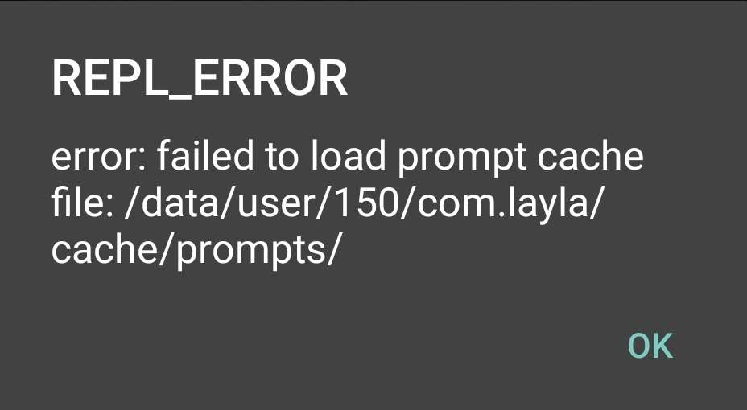

모델을 로드하는 중이거나 업데이트 후에 다음과 같은 오류가 표시될 수 있습니다.

이러한 오류는 보통 _설정_ 페이지로 이동하여 아래로 스크롤한 다음 *캐시 지우기*를 선택하면 해결할 수 있습니다.

오류 때문에 모델이나 앱을 다시 다운로드해야 하는 경우는 매우 드뭅니다. 캐시 지우기는 앱을 깨끗한 상태로 초기화하도록 설계되었습니다.

참고: 캐시를 지운 후에는 캐릭터를 처음 로드할 때 시간이 오래 걸립니다.
