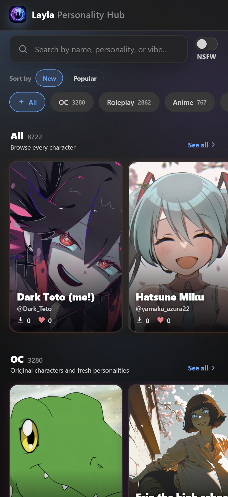

**Personality Hub는 채팅 중 어시스턴트가 연기할 AI 캐릭터를 찾아 다운로드할 수 있는 Layla 내장 기능입니다. 완전히 오프라인으로 작동하며 계정이나 개인 정보가 필요하지 않습니다.**

> **캐릭터 찾아보기 및 다운로드:** [chat.layla-cloud.com에서 Personality Hub 열기 →](https://chat.layla-cloud.com/)

TV 프로그램, 책, 영화 등 여러 배경의 캐릭터가 있으며 원하는 만큼 자신의 목록에 추가할 수 있습니다.

이 글에서는 Personality Hub의 개념, 클라우드 기반 캐릭터 앱과의 차이, Hub를 열고 캐릭터를 다운로드하는 방법, 자신의 캐릭터를 공유하는 방법을 설명합니다.

## Personality Hub란 무엇인가요?

Personality Hub는 Layla가 연기할 수 있는 캐릭터 또는 성격의 공유 모음입니다. 각 캐릭터는 AI의 말투, 자신에 관한 지식 및 대화 중 행동을 바꿉니다. 캐릭터를 다운로드하면 개인 목록에 추가되어 원하는 유형의 채팅에 맞춰 선택할 수 있습니다.

Layla는 기기에서 실행되므로 다운로드한 캐릭터와 오프라인으로 채팅할 수 있습니다. 성격이 휴대전화에 저장된 후에는 대화에 인터넷 연결이 필요하지 않습니다.

## Character.AI의 비공개 오프라인 대안

대부분의 캐릭터 채팅은 [Character.AI](https://character.ai)나 [Chub](https://chub.ai) 같은 클라우드 서비스를 통해 이루어집니다. 이러한 서비스는 계정이 필요하고 다른 회사의 서버에서 대화를 처리합니다. Personality Hub는 다른 방식을 사용합니다. 다운로드와 업로드가 모두 익명이며 가입, 이메일 또는 개인 정보를 제공할 필요가 없습니다.

대화를 자신의 기기에 보관하는 Character.AI 대안을 찾는 사용자에게 이것이 가장 큰 차이입니다. 다운로드한 캐릭터와의 채팅은 로컬에 남고, 카탈로그는 한 업체에 종속되지 않고 커뮤니티가 공유하며, 사용에 구독이 필요하지 않습니다.

## Personality Hub를 여는 방법

Personality Hub는 Layla의 앱 섹션에 있습니다.

1. 캐릭터 선택 화면의 오른쪽 위에서 **앱** 아이콘을 누릅니다.
2. **Personality Hub** 앱을 선택합니다.
3. 카탈로그를 둘러보고 관심 있는 캐릭터를 엽니다.
4. **다운로드**를 눌러 Layla에 캐릭터를 추가합니다.

다운로드가 끝나면 캐릭터 목록에 표시되며 언제든 채팅할 수 있습니다.

[chat.layla-cloud.com](https://chat.layla-cloud.com)의 웹 버전도 이용할 수 있습니다.

## 자신의 캐릭터 공유

직접 만든 캐릭터를 Personality Hub에 게시하여 다른 사용자가 다운로드하도록 할 수 있습니다. 업로드도 다운로드와 마찬가지로 익명이며 계정이나 개인 정보가 필요하지 않습니다. 식별 정보를 연결하지 않고 캐릭터를 공유 카탈로그에 추가할 수 있습니다.

## 자주 묻는 질문

### Layla의 Personality Hub란 무엇인가요?

Layla로 다운로드할 수 있는 AI 캐릭터의 내장 카탈로그입니다. 각 캐릭터는 어시스턴트에 고유한 성격을 부여하며 다운로드 후에는 오프라인으로 작동합니다.

### Personality Hub는 Character.AI의 대안인가요?

예. 여러 캐릭터를 찾아 채팅한다는 비슷한 목적을 제공하지만 기기에서 실행되고 계정이 필요 없으며 대화를 클라우드 서비스로 보내지 않습니다.

### 캐릭터를 다운로드하려면 계정이 필요한가요?

아니요. 다운로드와 업로드는 모두 익명입니다. 가입이나 개인 정보가 필요하지 않습니다.

### 다운로드한 캐릭터가 오프라인으로 작동하나요?

예. Layla는 기기에서 실행되므로 캐릭터를 다운로드한 후 인터넷 연결 없이 채팅할 수 있습니다.

### 다운로드한 캐릭터는 어디에 표시되나요?

캐릭터 목록에 표시됩니다. 다운로드가 끝나면 다른 성격과 마찬가지로 채팅을 시작할 수 있습니다.

### 직접 만든 캐릭터를 공유할 수 있나요?

예. 자신의 캐릭터를 Personality Hub에 익명으로 업로드하면 다른 사용자가 다운로드할 수 있습니다.

## 정리

Personality Hub는 커뮤니티가 공유하고 한 번의 탭으로 휴대전화에 다운로드할 수 있는 계속 성장하는 캐릭터 라이브러리를 Layla에 제공합니다. 모든 것이 기기에서 실행되므로 수집한 캐릭터는 계정이나 구독 없이 Android에서 오프라인으로 사용할 수 있습니다.
