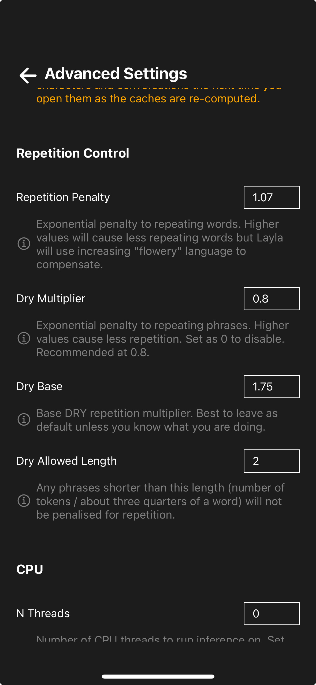

반복은 이 세대의 LLM, 특히 휴대전화에서 실행되는 모델에서 흔히 발생하는 문제입니다. 그 이유 중 하나는 각 뉴런의 정밀도를 낮추어 모델을 압축하는 양자화가 적용되었기 때문입니다.

캐릭터가 몇 가지 문구를 계속 반복할 때가 있습니다. 이 문제를 완화하려면 *고급 설정*으로 이동하여 DRY multiplier를 켜세요. 위 이미지에 표시된 값은 적절한 기본값입니다. 캐릭터에 가장 잘 맞는 결과를 얻도록 필요에 따라 값을 조정하세요.

이 현상이 발생하는 이유와 DRY의 작동 방식에 관한 자세한 설명은 [text-generation-webui의 DRY 샘플러 논의](https://github.com/oobabooga/text-generation-webui/pull/5677#issue-2177692564)를 참고하세요.
