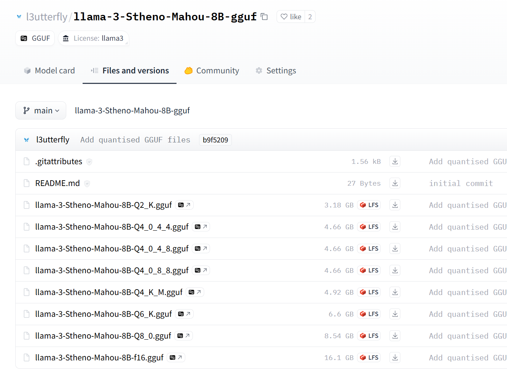
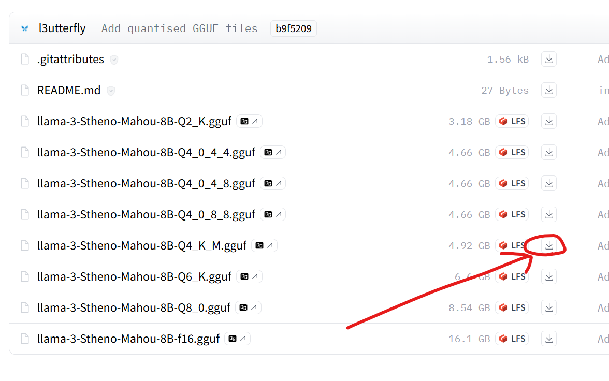

Hugging Face에서 로컬 AI 모델을 살펴봤다면 `.gguf`로 끝나는 파일을 자주 보았을 것입니다. GGUF 모델은 무엇이고 Layla를 포함한 거의 모든 오프라인 AI 앱이 이 형식을 사용하는 이유는 무엇일까요?

이 가이드에서는 GGUF의 의미와 작동 방식을 설명한 다음 원하는 사용자 지정 GGUF 모델을 Layla에 불러오는 과정을 안내합니다. 인터넷, 구독 또는 클라우드 서비스 없이 Android 휴대전화에서 검열 없는 모델, 롤플레이 모델 또는 특수 목적 AI 모델을 직접 실행할 수 있습니다.

## GGUF란 무엇인가요?

**GGUF는 노트북, 데스크톱, 휴대전화 같은 소비자용 하드웨어에서 대규모 언어 모델을 실행하기 위한 파일 형식입니다.** 하나의 `.gguf` 파일에는 모델 실행에 필요한 가중치, 토크나이저, 프롬프트 템플릿, 메타데이터가 휴대 가능한 바이너리로 모두 포함되며 GGUF 호환 추론 엔진에서 불러올 수 있습니다.

GGUF는 Layla에도 사용되는 오픈 소스 추론 엔진인 [llama.cpp](https://github.com/ggerganov/llama.cpp) 프로젝트에서 2023년 8월에 도입했습니다. 이전에는 GGML이라는 형식을 사용했으며 새 모델 아키텍처를 추가할 때마다 코드를 변경해야 했습니다. GGUF는 구조화된 메타데이터 시스템으로 이를 대체하여 로컬 실행 LLM 배포의 사실상 표준이 되었습니다.

Ollama, LM Studio, GPT4All, Jan, koboldcpp 또는 Layla를 사용했다면 자신도 모르게 GGUF를 사용한 것입니다.

## GGUF는 무엇의 약자인가요?

GGUF는 **GGML Universal File**의 약자입니다. GGML은 기반 텐서 라이브러리의 이름이며 제작자 Georgi Gerganov의 이름에서 따왔습니다. 온라인에서는 “GPT-Generated Unified Format”이라는 설명도 보이지만 llama.cpp 프로젝트는 “GGML Universal File”을 사용합니다.

## 모바일 오프라인 AI에서 GGUF 모델이 중요한 이유

GGUF의 핵심 기능은 **양자화**입니다. 모델 가중치를 16비트 또는 32비트 숫자에서 8, 4, 심지어 2비트로 줄이는 기술입니다. 모델의 성능을 훼손하지 않으면서 파일을 크게 줄여 70억 또는 80억 매개변수 모델을 휴대전화에서 실행할 수 있게 합니다.

실제로 GGUF를 사용하면 다음이 가능합니다.

- 인터넷 연결 없이 성능이 좋은 AI 어시스턴트를 완전히 **오프라인**으로 실행합니다.
- 기기 밖으로 데이터가 나가지 않으므로 대화를 **비공개**로 유지합니다.
- 구독과 사용량 제한을 피합니다.
- 특정 스타일에 맞게 미세 조정되거나 콘텐츠 필터가 제거된 모델을 포함해 **원하는 커뮤니티 모델**을 선택합니다.

## Layla의 사용자 지정 GGUF 모델로 할 수 있는 작업

Layla가 처음 실행될 때 다운로드하는 사전 구성 모델은 범용 어시스턴트로 사용하기 좋습니다. Layla에서는 **원하는 GGUF 모델**을 직접 불러올 수도 있습니다.

오픈 소스 커뮤니티는 여러 용도에 맞춰 수천 개의 GGUF 모델을 미세 조정했습니다.

- 일반 챗봇의 제한 없이 답하는 **검열 없거나 필터 없는 채팅 모델**
- 긴 몰입형 대화에 맞게 제작된 Stheno, MythoMax, Mahou 같은 **롤플레이 및 창작 모델**
- 프로그래밍 언어에 특화된 **코딩 모델**
- 문제 해결을 위한 **추론 및 수학 모델**
- 의학, 법률, 언어 학습 등의 **분야별 특화 모델**

Layla에서 잘 작동하도록 테스트한 GGUF 모델은 [l3utterfly Hugging Face 페이지](https://huggingface.co/l3utterfly)에서 찾아볼 수 있습니다.

## Layla에 사용자 지정 GGUF 모델을 불러오는 방법

인기 있는 Stheno-Mahou 롤플레이 모델을 예로 전체 과정을 설명합니다.

### 1단계 — Hugging Face에서 모델 선택하기

이 예에서는 Llama 3를 롤플레이에 맞게 미세 조정한 [Stheno-Mahou](https://huggingface.co/l3utterfly/llama-3-Stheno-Mahou-8B-gguf)를 사용합니다.

### 2단계 — Files and versions 탭 열기

Hugging Face에서 다운로드 가능한 모든 모델 변형을 이 탭에 표시합니다.

### 3단계 — 휴대전화에 맞는 양자화 선택하기

각 파일 이름에는 Q2_K, Q4_K_M, Q6_K, Q8_0 같은 Q 번호가 있습니다. 모델이 얼마나 압축되었는지를 나타내는 **양자화 수준**입니다.

규칙은 간단합니다.

- **Q 번호가 높음 = 파일이 큼 = 답변 품질이 높음. 단, 더 많은 RAM과 빠른 휴대전화가 필요합니다.**
- **Q 번호가 낮음 = 파일이 작음 = 성능이 낮은 하드웨어에서 빠름. 단, 답변 품질이 약간 낮습니다.**

대부분의 휴대전화에서는 **Q4_K_M**으로 시작하는 것이 좋습니다. 빠르고 반응성이 좋다면 품질 향상을 위해 Q6 또는 Q8을 사용하세요. 느리다면 Q3 또는 Q2로 낮추세요.

Q4_0_4_4, Q4_0_4_8, Q4_0_8_8이라는 특수 양자화도 있습니다. **i8mm** 하드웨어 가속을 지원하는 최신 ARM 휴대전화에 최적화되어 있으며 지원 기기에서 훨씬 빠르게 실행될 수 있습니다. 휴대전화 지원 여부는 [Layla의 i8mm 하드웨어 지원 가이드](https://www.layla-network.ai/post/layla-supports-i8mm-hardware-for-running-llm-models)를 참조하세요.

### 4단계 — 파일 다운로드하기

선택한 양자화 옆의 다운로드 화살표를 누르세요. `.gguf` 파일이 휴대전화의 Downloads 폴더 또는 브라우저의 저장 위치에 저장됩니다.

### 5단계 — Layla에 모델 추가하기

Layla를 열고 **Inference Settings** → **Add a custom model** → **Local file**로 이동하세요. 파일 선택기를 사용하여 다운로드한 `.gguf` 파일을 찾으세요.

파일 선택기에서 방금 다운로드한 모델을 선택하세요.

### 6단계 — 올바른 프롬프트 형식 설정하기

사람들이 자주 잊는 단계입니다. 각 모델 제품군은 특정 형식으로 감싼 프롬프트를 기대합니다. Llama 3, Mistral, ChatML은 각각 다른 형식을 사용합니다. 모델의 Hugging Face 페이지에서 필요한 형식을 확인하고 Layla의 프롬프트 형식 설정에서 선택하세요. 이제 사용자 지정 GGUF 모델이 휴대전화에서 완전히 오프라인으로 실행됩니다.

## GGUF에 대해 자주 묻는 질문

### GGUF 파일이란 무엇인가요?

`.gguf` 파일은 AI 모델의 가중치, 토크나이저 및 구성을 하나로 묶은 바이너리입니다. llama.cpp를 비롯한 여러 로컬 AI 도구가 언어 모델을 불러오고 실행할 때 사용합니다.

### AI 모델에서 GGUF는 무엇을 의미하나요?

Hugging Face에서 GGUF로 표시된 모델은 GGUF 형식으로 변환되어 Layla, llama.cpp, Ollama 또는 LM Studio를 통해 GPU 서버나 클라우드 API 없이 소비자용 하드웨어에서 로컬로 실행할 수 있다는 의미입니다.

### GGUF가 safetensors 또는 PyTorch보다 낫나요?

용도가 다릅니다. PyTorch와 safetensors는 전체 정밀도, 큰 크기, GPU 중심의 학습 및 연구 형식입니다. GGUF는 양자화되고 작으며 CPU, 휴대전화 및 보급형 GPU에 최적화된 **추론** 형식입니다. 모델을 _학습_하는 대신 _사용_하려면 GGUF가 더 적합합니다.

### Android에서 GGUF 모델을 실행할 수 있나요?

예. Layla가 바로 그 기능을 제공합니다. Layla는 Android에서 llama.cpp를 사용하며 기기의 GGUF 모델을 불러오거나 Hugging Face에서 다운로드할 수 있습니다.

### 어떤 GGUF 양자화를 다운로드해야 하나요?

크기, 속도, 품질의 균형이 좋은 **Q4_K_M**으로 시작하세요. 휴대전화가 처리할 수 있으면 Q6 또는 Q8로 높이고 그렇지 않으면 Q3 또는 Q2로 낮추세요.

### GGUF 모델은 어디에서 찾을 수 있나요?

가장 큰 컬렉션은 [Hugging Face](https://huggingface.co)에 있습니다. 모델 이름 뒤에 “GGUF”를 붙여 검색하면 양자화 버전을 찾을 수 있습니다. Layla에서 잘 작동하도록 테스트한 모델은 [huggingface.co/l3utterfly](https://huggingface.co/l3utterfly)를 참조하세요.
