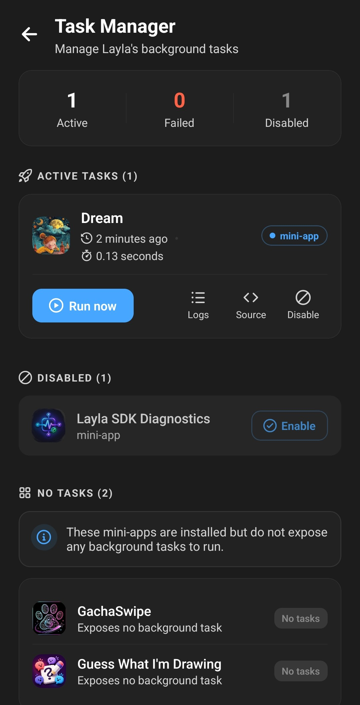

**A `task.js` file gives a Layla mini-app a single-shot JavaScript task that Layla can run periodically in the background, without opening the mini-app's WebView.** The task runs in an isolated runtime, receives a ready-to-use Layla SDK client, and can return a result for the user to inspect in Layla's Task Manager.

This guide explains the execution model, shows a small standalone task, and then builds a generated `task.js` so a larger mini-app can reuse the same workflow in its interface and background task.

The Task Manager separates active and disabled tasks from installed mini-apps that do not provide background work. For each active task, it exposes manual execution, logs, and the generated source in one place.



If you are new to mini-app development, start with [Getting started with the Layla SDK](/getting-started-with-the-layla-sdk/).

## What is `task.js`?

`task.js` is an optional file at the root of a packaged Layla mini-app, next to `app.json` and `index.html`:

```text
my-mini-app/
  app.json
  index.html
  task.js
  icon.png
```

When Layla finds the file, the mini-app appears in the Task Manager. The user can run the task manually, enable or disable its background execution, and review the result and logs from its latest run.

A task is not a continuously running service. Layla starts it, waits for its final value or promise to settle, records the outcome, and disposes of its runtime. The host controls when periodic background work is attempted, so `task.js` should perform one useful pass and finish. Do not put your own scheduler or polling loop inside it.

This makes `task.js` suitable for work such as:

- Reading recent chats or memories and storing a summary.
- Updating cached data for the next time the mini-app opens.
- Creating or updating structured records in the mini-app's database.
- Generating a message and scheduling it for later.
- Checking which characters need work and processing each one once.

## How Layla runs a background task

The WebView and task environments use the same SDK protocol, but they are separate runtimes.

When Layla runs a task, it:

1. Creates a fresh QuickJS runtime scoped to that mini-app.
2. Preloads the Layla SDK and connects it to the host.
3. Evaluates the mini-app's `task.js` as a classic JavaScript script.
4. Waits if the script's completion value is a promise.
5. Records whether the run succeeded, how long it took, its output, and its buffered console logs.
6. Destroys the runtime.

The background queue runs eligible mini-app tasks while Layla is not active in the foreground. Disabled tasks are skipped. A manual run uses the same isolated execution model.

Because every run starts clean, variables declared in one execution will not exist in the next one. Save durable state through the SDK. `layla.db.executeSql(...)` is a good default for structured data. The task and the WebView app use the same private mini-app storage, so the interface can read what the background task saved.

## The Layla SDK is already available

Do not import `@layla-network/sdk` in the final `task.js`. Layla injects the SDK before your code runs and provides these globals:

- `layla`: a ready-to-use SDK client.
- `Layla`: the SDK client class.
- `LaylaError`, `LaylaAbortError`, and `LaylaBridgeUnavailableError`: the SDK error classes.

In most tasks, use the existing `layla` instance directly:

```js
const characters = await layla.characters.list(0, 10);
```

That line belongs inside an async function, however. `task.js` is evaluated as a classic script rather than an ES module, so top-level `await`, `import`, `export`, and `require(...)` are not available. Wrap asynchronous work in an async immediately invoked function expression, or async IIFE, and make that promise the final expression in the file.

The runtime is also not a browser. It has no DOM, `document`, `fetch`, `XMLHttpRequest`, `localStorage`, `setTimeout`, or `setInterval`. Promises, `async`/`await`, `queueMicrotask`, `JSON`, and SDK calls work normally.

Prefer SDK methods that make sense without a visible interface, including non-streaming chat completions, characters, memories, scheduled messages, sentiment classification, private files, and the private SQLite database. Avoid UI or device-interaction flows such as microphone input, TTS playback, and background audio. Long-lived event listeners are also a poor fit because the runtime disappears when the task finishes.

## A simple `task.js` example

This task counts the first page of characters and records each run in the mini-app's private database:

```js
// task.js — the host has already created the global `layla` client.
console.info("Character snapshot task starting.");

(async () => {
  const ranAt = Date.now();
  const characters = await layla.characters.list(0, 10);

  await layla.db.executeSql(
    "CREATE TABLE IF NOT EXISTS character_snapshots (" +
      "id INTEGER PRIMARY KEY, ran_at INTEGER, character_count INTEGER)",
  );

  await layla.db.executeSql(
    "INSERT INTO character_snapshots (ran_at, character_count) VALUES (?, ?)",
    [ranAt, characters.length],
  );

  console.info(`Recorded ${characters.length} characters.`);

  return {
    status: "ok",
    ranAt,
    characterCount: characters.length,
  };
})();
```

The async IIFE is deliberately the last expression. Layla waits for its promise, then records the returned object as the run's output. Keep the return value JSON-serializable. A rejected promise or thrown error marks the run as failed, while anything written with `console.log`, `console.info`, `console.debug`, `console.warn`, or `console.error` is buffered into the execution log.

Logs are shown after the run finishes rather than streamed live. Use them for concise milestones and diagnostic context, and use the returned value for the final machine-readable summary.

## Generate `task.js` when the workflow is more complex

Hand-writing `task.js` works for a small job. It becomes awkward when the background task should use the same selection, prompting, validation, or persistence logic as the visible mini-app.

Dream, a working Layla mini-app, uses a separate task entry and build configuration. Its task entry imports shared workflow and prompt modules from the main application source. Vite follows those imports and generates one standalone `dist/task.js` with the shared code bundled into it. The generated artifact contains no imports, but the source remains split into normal maintainable modules.

The key design decision is dependency injection: shared code receives a Layla client instead of constructing one internally. The WebView passes its imported SDK client; the task passes the host-provided global `layla` client.

Start with a shared workflow:

```ts
// src/lib/recordCharacterSnapshot.ts
import type LaylaSDK from "@layla-network/sdk";

export async function recordCharacterSnapshot({
  layla,
  ranAt = Date.now(),
}: {
  layla: LaylaSDK;
  ranAt?: number;
}) {
  const characters = await layla.characters.list(0, 10);

  await layla.db.executeSql(
    "CREATE TABLE IF NOT EXISTS character_snapshots (" +
      "id INTEGER PRIMARY KEY, ran_at INTEGER, character_count INTEGER)",
  );
  await layla.db.executeSql(
    "INSERT INTO character_snapshots (ran_at, character_count) VALUES (?, ?)",
    [ranAt, characters.length],
  );

  return { status: "ok", ranAt, characterCount: characters.length };
}
```

The type-only import helps TypeScript check the shared function and disappears from the compiled JavaScript. The visible mini-app can call the same function with its regular SDK instance:

```ts
// src/main.ts
import LaylaSDK from "@layla-network/sdk";
import { recordCharacterSnapshot } from "./lib/recordCharacterSnapshot";

const layla = new LaylaSDK();

document.querySelector("#refresh")?.addEventListener("click", async () => {
  const result = await recordCharacterSnapshot({ layla });
  console.log(result);
});
```

Then create a small task entry. It imports the shared source while you are developing, but the build removes that module boundary:

```js
// src/task-entry.js
import { recordCharacterSnapshot } from "./lib/recordCharacterSnapshot";

console.info("Character snapshot background task starting.");

(async () => {
  return recordCharacterSnapshot({ layla });
})();
```

Give that entry its own Vite build:

```ts
// vite.task.config.ts
import { defineConfig } from "vite";

export default defineConfig({
  publicDir: false,
  build: {
    target: "es2020",
    outDir: "dist",
    emptyOutDir: false,
    copyPublicDir: false,
    minify: false,
    lib: {
      entry: "src/task-entry.js",
      formats: ["es"],
      fileName: () => "task.js",
    },
  },
});
```

Run the normal WebView build first, then the task build:

```json
{
  "scripts": {
    "build": "vite build && vite build --config vite.task.config.ts",
    "build:task": "vite build --config vite.task.config.ts"
  }
}
```

`emptyOutDir: false` preserves the `index.html`, `app.json`, and assets created by the first build. The second build adds `dist/task.js` beside them.

Keep runtime imports of `@layla-network/sdk` out of the task's dependency graph. Type-only imports are fine, but the generated task should use the injected client rather than bundling another SDK client. In a larger app, keep WebView-only code such as DOM updates, React state, browser storage, and streaming UI outside the shared workflow.

Dream applies this separation at a larger scale: its source task handles headless data loading and orchestration, while shared modules contain the workflow that chooses and schedules a character message. The production `task.js` is generated from those sources, so fixes to the shared workflow apply to both the visible action and the background task.

## Verify the generated artifact

Test the file Layla will actually run, not only `src/task-entry.js`.

After building, confirm that `dist/task.js`:

- Is at the root of the package beside `app.json` and `index.html`.
- Has no `import`, `export`, or `require(...)` statements.
- Does not bundle or reference `@layla-network/sdk` at runtime.
- Ends with the promise-producing async IIFE as its completion expression.
- Does not call browser APIs, timers, or `fetch`.
- Returns a JSON-serializable value on every successful path.

For a complex task, add a small test harness that evaluates `dist/task.js` with a fake global `layla` object. The Dream mini-app uses this approach to exercise the generated artifact, capture SDK requests, and verify both idle and successful scheduling paths. Testing the bundle catches problems that a source-level unit test misses, including leftover imports and a task entry whose final value is not the workflow promise.

## Frequently asked questions

### Does `task.js` run inside the mini-app WebView?

No. It runs in a fresh isolated QuickJS runtime. It cannot access the page, React state, or DOM, but it can use the preloaded Layla SDK.

### Should I import `LaylaSDK` in `task.js`?

No. Use the injected global `layla` instance. In shared TypeScript modules, a type-only SDK import is fine because it is removed during compilation.

### How do I share data between the task and the interface?

Use the mini-app's private SDK storage. `layla.db.executeSql(...)` works well for structured state, while the SDK's private file utilities suit document-shaped settings or generated files. Both executions are scoped to the same mini-app.

### Can a task wait until later with `setTimeout`?

No. Timers are not available, and a background task should finish one pass. Return after completing the current work. For a future character message, use `layla.chat.scheduleChatMessage(...)` rather than keeping the task alive.

### What should a background task return?

Return a small JSON-serializable summary such as `{ status: "ok", processed: 4 }`. Use console messages for diagnostic detail. Throw an error when the run genuinely failed so the Task Manager reports it as a failure.

## Build for a short-lived, headless runtime

The useful mental model is not “a hidden copy of my mini-app.” It is “one background pass with the Layla SDK already connected.” Keep the entry small, move reusable work into functions that accept their dependencies, persist anything needed by the interface, and let the generated `task.js` finish with a clear result.

That structure keeps the background artifact compatible with Layla's isolated runtime while letting a larger mini-app maintain one implementation of its core workflow.
