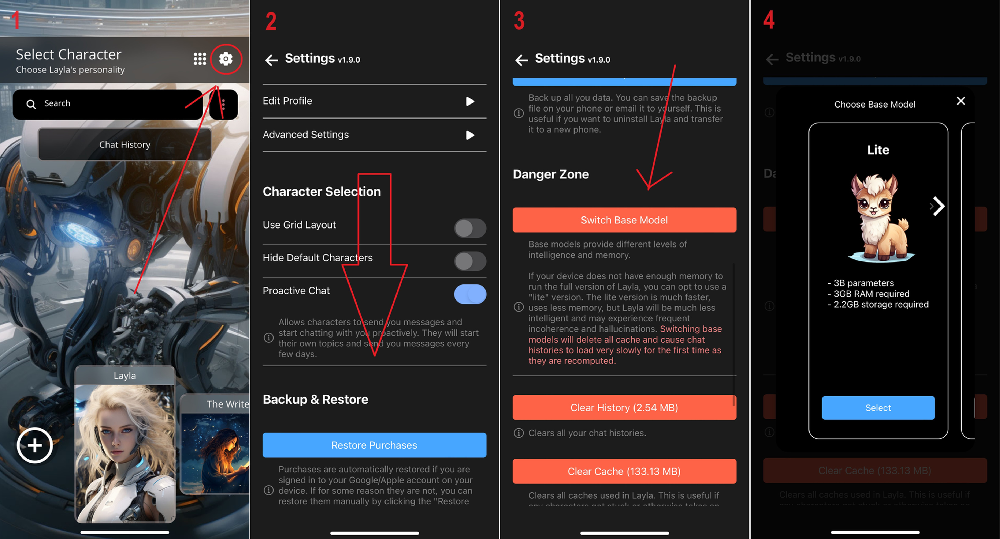

Layla lets you switch base models. A base model is the "brain" of Layla, and it powers all characters, scenes, roleplay, and other features.

Depending on your device's capabilities—see [which model your device supports](https://www.layla-network.ai/contact)—you can choose among several base models:

**Layla Lite**

- Requires at least 4 GB of phone RAM.
- Primarily intended for older devices so that more people can experience Layla.

**Layla Q2**

- Requires 4 GB of phone RAM.
- An in-between model that balances performance with capability.

**Layla Full**

- Requires at least 8 GB of phone RAM. Note that this is different from phone storage.
- The most intelligent version of Layla.
- Stays in character better.
- Is less prone to hallucination.
- Runs only on flagship devices released within the last two years.

**How to switch between base models**

Starting from the character-selection screen:

1. Tap the gear icon in the top-right corner to open the *Settings* page.
2. Scroll down to the *Danger Zone* section.
3. Tap *Switch Base Model*.
4. Choose the model that fits your needs.

